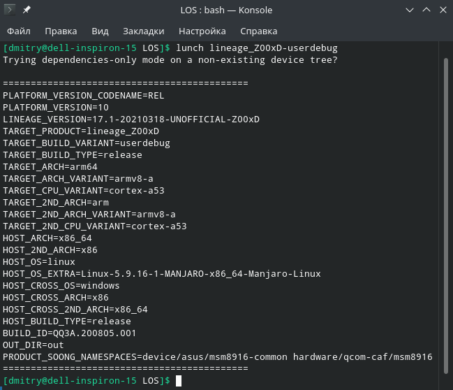
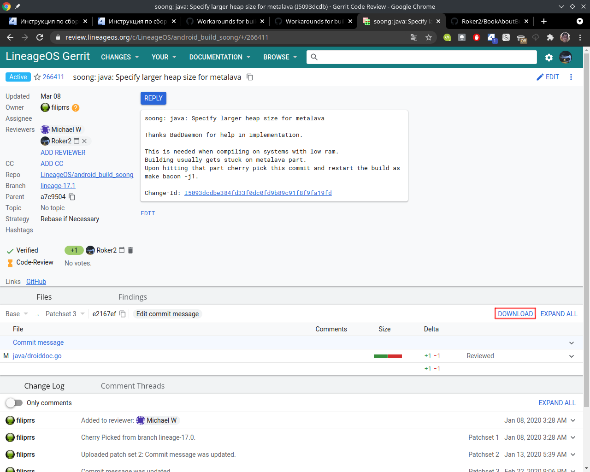
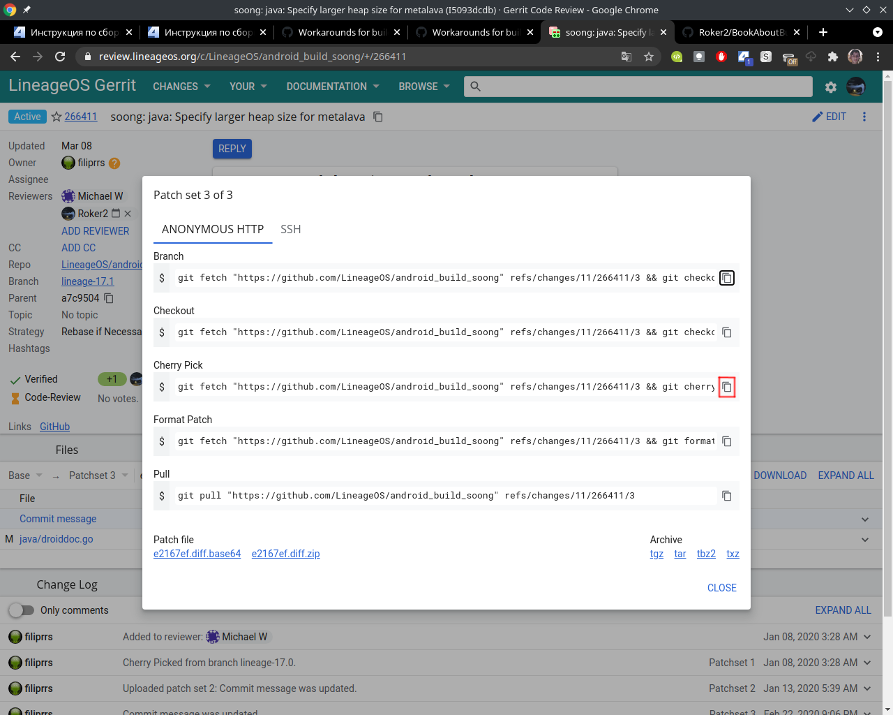

# Параграф 5: Инициализация и сборка

И вот мы переходим к самому ~~интересному~~, страшному и интригующему  в этой главе - к сборке готовой прошивки!

Для начала требуется настроить окружение, что происходит посредством запуска скрипта build/envsetup.sh. Тут уместна шутка "есть два типа людей":

```bash
. build/envsetup.sh
```

```bash
source build/envsetup.sh
```

Да, это два варианта как запустить скрипт. Автор данного текста относит себя к первому типу людей.

Окей, теперь требуется указать системе сборки под какое устройство происходит сборка. Команда должна быть следующей:

```bash
lunch lineage_codename-userdebug
```

Где codename - кодовое название устройства. Не боимся, сидим и ждем, когда сделает все, что требуется системе сборки.



Отлично! Мы можем почитать почти всю информацию об устройстве, на которое собираем прошивку, и немного об ОС, которая стоит на машине для сборки. Теперь мы готовы собирать. И тут снова 2 варианта:

1) сборка прошивки с использованием make и количеством потоков (потоки можно не указывать)

```bash
make bacon -j#
```

2) сборка прошивки с использованием mka, он сам устанавливает количество потоков

```bash
mka bacon
```

В чем разница? Об этом нам скажет [Mirsaid02](https://4pda.to/forum/index.php?showuser=4383879) с 4PDA:

> **mka** - лучшая команда для сборки в плане качества, т.к использует программу sched_tool, при сборке будет возникать меньше ошибок, выбирает для каждой части сборки подходящий компилятор, но при этом сборка проходит на несколько часов дольше, в зависимости от ТХ вашего ПК или ноутбука, также его называют "супер-заряженной" версией make.
>
> [Пост](https://4pda.to/forum/index.php?showtopic=209610&view=findpost&p=44763389)

Теперь поговорим о том, что нам делать, если сборка падает с ошибкой, что не хватает ОЗУ. В данном случае поможет несколько ухищрений.

Android 10

1) идем в папку build/soong

```bash
cd build/soong
```

2) открываем на Lineage OS Gerrit [нужный коммит](https://review.lineageos.org/c/LineageOS/android_build_soong/+/266411)

3) нажимаем кнопку "DOWNLOAD"



4) напротив варианта "Cherry Pick" нажимаем кнопку копирования



5) копируем в терминал и нажимаем Enter

6) возвращаемся в корень исходников

```bash
cd ../..
```

7) сделайте все приготовления для сборки, но не запускайте сборку

8) заранее собираем по одному компоненты, которые требуют много ОЗУ

```bash
mka api-stubs-docs && mka hiddenapi-lists-docs && mka system-api-stubs-docs && mka test-api-stubs-docs
```

9) запускаем сборку прошивки

[Референс](https://gist.github.com/mikecriggs/d98f2fc3461b23732fabebb020e4c42e)

Android 11

Для него все тоже самое, отличие только в [коммите](https://review.lineageos.org/c/LineageOS/android_build_soong/+/289926) и какие компоненты предсобираем.

```bash
mka api-stubs-docs && mka module-lib-api-stubs-docs && mka system-api-stubs-docs && mka test-api-stubs-docs
```

[Референс](https://gist.github.com/verNANDo57/d76bb6e6e4b887101cf5a1cf64c66cef)