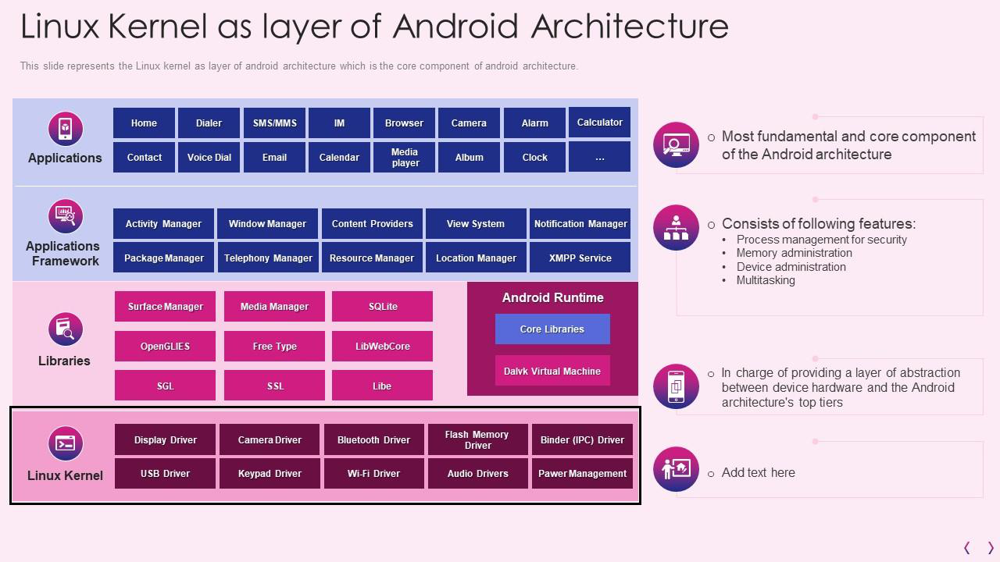

# Параграф 4: Что такое Ядро

Что такое ядро? Ядро операционной системы - в данном случае Android - это **компонент, который помогает вашим приложениям взаимодействовать с вашим оборудованием.** Оно управляет системными ресурсами, при необходимости обменивается данными с внешними устройствами и т. д. Android использует вариант ядра Linux, содержит базовый набор драйверов, которые необходимы для работы устройства. Поскольку ядро Android по умолчанию является производным от ядра Linux, можно с уверенностью сказать, что ядро Android также является [монолитным](https://ru.wikipedia.org/wiki/%D0%9C%D0%BE%D0%BD%D0%BE%D0%BB%D0%B8%D1%82%D0%BD%D0%BE%D0%B5_%D1%8F%D0%B4%D1%80%D0%BE). Рассмотрим пример: предположим, вы установили приложение для съемки фотографий. Для этого вам нужно получить доступ к камере вашего телефона. Но приложение не может этого сделать. Оно не может напрямую получить доступ к камере, чтобы делать фотографии. Вместо этого оно посылает запрос ядру, и ядро предоставляет доступ к камере. Без ядра для приема и отправки информации разработчикам пришлось бы писать код для каждого отдельного события для каждого отдельного элемента ПО вашего устройства. С ядром все, что им нужно делать, это взаимодействовать с ним через API системы Android, а разработчикам нужно только заставить ПО устройства взаимодействовать с ядром.

### Почему ядро должно постоянно обновляться?

Ядро Linux постоянно меняется. Множество улучшений попадает в ядро, чтобы сделать его более надежным, безопасным и продвинутым каждый день. Вполне логично, что вся эта дельта улучшений попадает в ядро Android при любой возможности. Многие производители сохраняют ядро неизменным при незначительном обновлении Android, в основном потому, что обновление ядра (называемое BSP - Board Support package) часто приходит от производителя чипсета (TI, Samsung, Qualcomm, Mediatek и т.д.). При изменении ядра для обновления Android, часто требуется много тестирования и обеспечения стабильности. Поэтому это часто приводит к задержке обновлений Android, а иногда и к прекращении обновлений ядра, когда поставщики чипсетов не поддерживают их.
Так же это объясняет, почему производители не очень часто обновляют версию ядра вместе с версией Android.