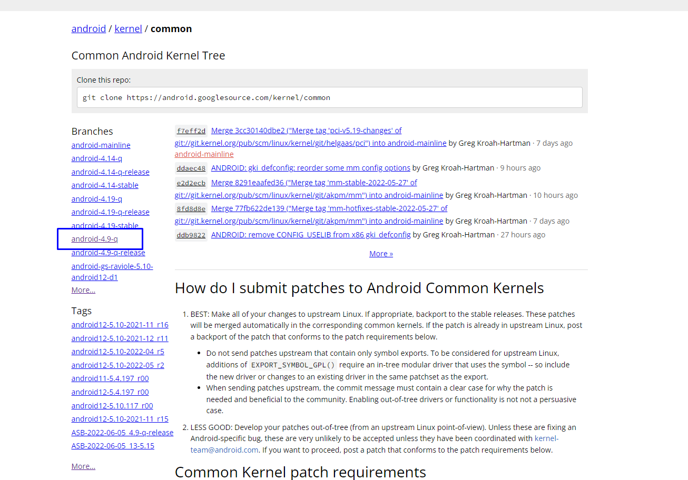

# Параграф 5: Обновление и билдинг ядра

Для обновления ядра, вам нужен хотя бы средний уровень знаний того, как же работает ядро (см. [что такое ядро](https://github.com/Roker2/BookAboutBuilding/blob/master/%D0%93%D0%BB%D0%B0%D0%B2%D0%B0%203%20%D0%B8%D0%B7%D1%83%D1%87%D0%B5%D0%BD%D0%B8%D0%B5%20%D0%B8%D1%81%D1%85%D0%BE%D0%B4%D0%BD%D0%B8%D0%BA%D0%BE%D0%B2%20%D1%83%D1%81%D1%82%D1%80%D0%BE%D0%B9%D1%81%D1%82%D0%B2%D0%B0/%D0%9F%D0%B0%D1%80%D0%B0%D0%B3%D1%80%D0%B0%D1%84%204%20%D0%A7%D1%82%D0%BE%20%D1%82%D0%B0%D0%BA%D0%BE%D0%B5%20%D1%8F%D0%B4%D1%80%D0%BE.md#%D0%BF%D0%B0%D1%80%D0%B0%D0%B3%D1%80%D0%B0%D1%84-4-%D1%87%D1%82%D0%BE-%D1%82%D0%B0%D0%BA%D0%BE%D0%B5-%D1%8F%D0%B4%D1%80%D0%BE)) и в целом Android, а так же умение пользоваться git (см. [ходовые команды git](https://github.com/Roker2/BookAboutBuilding/blob/master/%D0%93%D0%BB%D0%B0%D0%B2%D0%B0%202%20git%2C%20%D1%81%20%D1%87%D0%B5%D0%BC%20%D0%B5%D0%B3%D0%BE%20%D0%B5%D0%B4%D1%8F%D1%82%20%D0%B8%20%D0%B7%D0%B0%D1%87%D0%B5%D0%BC%20%D0%BE%D0%BD/%D0%9F%D0%B0%D1%80%D0%B0%D0%B3%D1%80%D0%B0%D1%84%202%20%D0%A5%D0%BE%D0%B4%D0%BE%D0%B2%D1%8B%D0%B5%20%D0%BA%D0%BE%D0%BC%D0%B0%D0%BD%D0%B4%D1%8B%20git'%D0%B0.md#%D0%BF%D0%B0%D1%80%D0%B0%D0%B3%D1%80%D0%B0%D1%84-2-%D1%85%D0%BE%D0%B4%D0%BE%D0%B2%D1%8B%D0%B5-%D0%BA%D0%BE%D0%BC%D0%B0%D0%BD%D0%B4%D1%8B-git%D0%B0))

## Обновление


### Подготовка

Давайте, для начала узнаем какие стабильные версии ядра Android на данный момент (2022 г.) активно обновляются. Вот список для наглядности: *4.9, 4.14, 4.19, 5.4, 5.10, 5.15*. Должен сразу предупредить, что обновить ядро, предположим, с 4.9 до 4.19 без дополнительных изменений невозможно, т.к. производитель делал специфические драйвера устройства именно для 4.9 и без углублённых знаний в ядре у вас это сделать не получится. Поэтому, зачастую, маинтейнеры обновляют **sublevel** ядра, это мы и будем делать ниже. Чтобы узнать его, заходим в исходник ядра, которое хотим обновить, в корне находим и открываем файлик **Makefile**, в самом верху (обычно) видим такую картину:


> *Либо просто заходим на своём смартфоне в Настройки > О Телефоне (только если на смартфоне установлено то же ядро, исходники которого вы собираететсь обновить*)

Узнали. После этого нужно найти репозиторий общего (common) ядра, с которого и будем обновлять, обычно используют https://android.googlesource.com/kernel/common/, но можно и другие зеркала. Например https://git.codelinaro.org/clo/la/kernel/msm (только для qualcomm).

Смотрим в список бранчей и выбираем со своей версией ядра:



После чего смотрим на название последнего коммита, должно быть что-то по типу `Merge <версия ядра>`, если sublevel выше, чем в ваших в исходниках, тогда можно продолжать. Если же нет, то поздравляю, у вас последняя версия


### Скачиваем репозитории

Для примера, я буду использовать [4.9.268](https://github.com/PixelExperience-Devices/kernel_lenovo_sdm710/tree/81bad83b39681cc137d99a1b613839032dab9184) ядро от Lenovo Z5s (jd2019) и обновлю его до [4.9.319](https://github.com/PixelExperience-Devices/kernel_lenovo_sdm710/tree/76e4fbb527d37378bac0a982c3df9551f17dbfe7). Также, для удобства, рекомендую использовать [GitHub  Desktop](https://github.com/shiftkey/desktop), хоть в нём и не присутствует весь функционал.

1. Для начала нам нужно склонировать исходники своего ядра, описывать как это делать я думаю не нужно, после добавляем репозиторий в GitHub Desktop (опять же, это не обязательно, все действия можно выполнить только через git).

2. Затем, открываем терминал в папке с исходниками вашего ядра и добавляем наш удаленный репозиторий общего ядра командой:
   ```bash
   git remote add common url 
   ```

   `common` - название, можете использовать любое другое
   `url` - ссылка на репозиторий

3. Теперь фетчим добавленный репозиторий:
   ```bash
   git fetch common
   ```
   > *Если вам лень или не позволяет интернет скачать весь репозиторий, можете в конце команды добавить название бранча, тогда скачивать будет только его.*

[картинка с списком бранчей]


### Мержим изменения

Обновлять ядро лучше всего по одному саблевелу - так больший шанс понять в какой версии и коммите проблема, если у вас будут ошибки при сборке, либо в самой системе, я же рисковый и делал сразу по пять (о чём потом пожалел).

1. Находим нужную нам версию с помощью поиска в разделе тэгов:
   

2. Копируем SHA и мержим этот коммит в нашем бранче:
   ```bash
   git merge sha
   ```
   > Если никаких конфликтов нет, то можете замержить ещё пару. Но опять же, вы не будете знать на какой версии у вас всё поломалось, так что лучше мержить по одному-два и билдить, если ядро забилдилось и система запустилась, то переходим к следующим саблевелам.

### Фиксим конфликты

Здесь всё довольно муторно. Лично я делаю по такой схеме: Если появляются конфликты, то открываю GitHub Desktop, с помощью него намного легче найти их, т.к. они все сразу отображаются, вместе с поломанными строками. Если конфликт простой, то фикшу вручную, если же ничего не понятно, то захожу в common репо, открываю просмотр файлов во временной точке нужного тэга и ищу этот конфликтный файл там, открываю историю коммитов для него и смотрю, как делали там и просто повторяю всё в свой файл. Конфликтных файлов может быть очень много, так что наберитесь терпения и не спешите, т.к. одна лишняя строчка или ошибка в тексте и ядро у вас не забилдится, либо не запустится.

## Билдинг


### Из исходников прошивки 

Этот способ для тех, кто уже знает как билдить прошивки и т.д. Проходим по обычному сценарию подготовки к билдингу прошивки, только вместо команды запуска билдинга прошивки (`mka bacon`, `make bacon` и др.), пишем `mka bootimage`.

### Из папки ядра