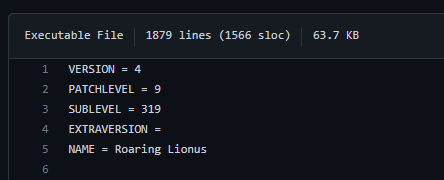

# Параграф 5: Обновление и билдинг ядра

Для обновления ядра, вам нужен хотя бы средний уровень знаний того, как же работает ядро (см. [что такое ядро](https://github.com/Roker2/BookAboutBuilding/blob/master/%D0%93%D0%BB%D0%B0%D0%B2%D0%B0%203%20%D0%B8%D0%B7%D1%83%D1%87%D0%B5%D0%BD%D0%B8%D0%B5%20%D0%B8%D1%81%D1%85%D0%BE%D0%B4%D0%BD%D0%B8%D0%BA%D0%BE%D0%B2%20%D1%83%D1%81%D1%82%D1%80%D0%BE%D0%B9%D1%81%D1%82%D0%B2%D0%B0/%D0%9F%D0%B0%D1%80%D0%B0%D0%B3%D1%80%D0%B0%D1%84%204%20%D0%A7%D1%82%D0%BE%20%D1%82%D0%B0%D0%BA%D0%BE%D0%B5%20%D1%8F%D0%B4%D1%80%D0%BE.md#%D0%BF%D0%B0%D1%80%D0%B0%D0%B3%D1%80%D0%B0%D1%84-4-%D1%87%D1%82%D0%BE-%D1%82%D0%B0%D0%BA%D0%BE%D0%B5-%D1%8F%D0%B4%D1%80%D0%BE)) и в целом Android, а так же умение пользоваться git (см. [ходовые команды git](https://github.com/Roker2/BookAboutBuilding/blob/master/%D0%93%D0%BB%D0%B0%D0%B2%D0%B0%202%20git%2C%20%D1%81%20%D1%87%D0%B5%D0%BC%20%D0%B5%D0%B3%D0%BE%20%D0%B5%D0%B4%D1%8F%D1%82%20%D0%B8%20%D0%B7%D0%B0%D1%87%D0%B5%D0%BC%20%D0%BE%D0%BD/%D0%9F%D0%B0%D1%80%D0%B0%D0%B3%D1%80%D0%B0%D1%84%202%20%D0%A5%D0%BE%D0%B4%D0%BE%D0%B2%D1%8B%D0%B5%20%D0%BA%D0%BE%D0%BC%D0%B0%D0%BD%D0%B4%D1%8B%20git'%D0%B0.md#%D0%BF%D0%B0%D1%80%D0%B0%D0%B3%D1%80%D0%B0%D1%84-2-%D1%85%D0%BE%D0%B4%D0%BE%D0%B2%D1%8B%D0%B5-%D0%BA%D0%BE%D0%BC%D0%B0%D0%BD%D0%B4%D1%8B-git%D0%B0))

## Обновление

### Подготовка

Давайте, для начала узнаем какие стабильные версии ядра Android на данный момент (2022 г.) активно обновляются. Вот список для наглядности: *4.9, 4.14, 4.19, 5.4, 5.10, 5.15*. Должен сразу предупредить, что обновить ядро, предположим, с 4.9 до 4.19 без дополнительных изменений невозможно, т.к. производитель делал специфические драйвера устройства именно для 4.9 и без углублённых знаний в ядре у вас это сделать не получится. Поэтому, зачастую, маинтейнеры обновляют **sublevel** ядра, это мы и будем делать ниже. Чтобы узнать его, заходим в исходник ядра, которое хотим обновить, в корне находим и открываем файлик **Makefile**, в самом верху (обычно) видим такую картину:

> *Либо просто заходим на своём смартфоне в Настройки > О Телефоне (только если на смартфоне установлено то же ядро, исходники которого вы собираететсь обновить*)

Узнали. После этого нужно найти репозиторий общего (common) ядра, с которого и будем обновлять, обычно используют https://android.googlesource.com/kernel/common/, но можно и другие зеркала. Например https://git.codelinaro.org/clo/la/kernel/msm (только для qualcomm).

Смотрим в список бранчей и выбираем со своей версией ядра:

После чего смотрим на название последнего коммита, должно быть что-то по типу `Merge <версия ядра>`, если sublevel выше, чем в ваших в исходниках, тогда можно продолжать. Если же нет, то поздравляю, у вас последняя версия

### Скачиваем репы

Для примера, я буду использовать [4.9.268](https://github.com/Ultra119/kernel_lenovo_sdm710/tree/eleven) ядро от Lenovo Z5s (jd2019) и обновлю его до 4.9.319. Также, для удобства, рекомендую использовать [GitHub  Desktop](https://github.com/shiftkey/desktop)

### Мержим изменения

### Фиксим конфликты

## Билдинг